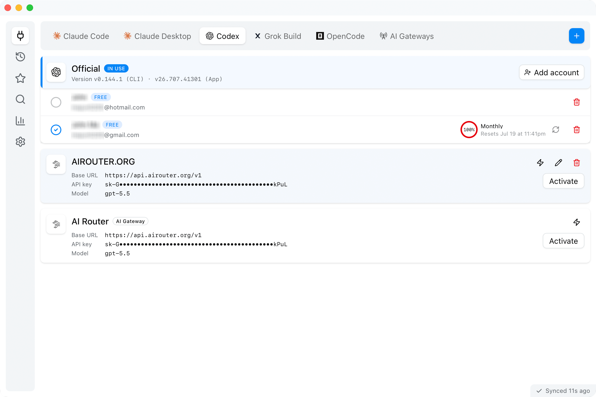
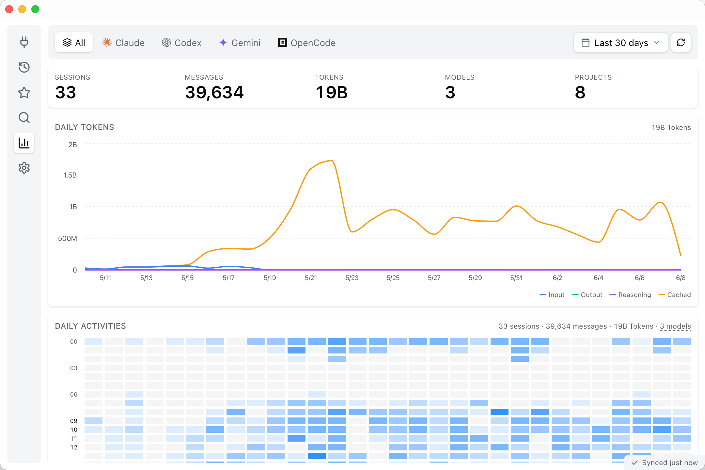

<div align="center">

# Termory

**The memory for your terminal AI coding tools — browse every session, and switch API providers in a click.**

[](https://github.com/chats-is/termory/releases)
[](https://github.com/chats-is/termory/releases)
[](LICENSE)


</div>

Termory brings **Codex**, **Claude Code**, **Gemini CLI**, and **OpenCode** together in one window. Browse every past session, memory file, and skill from all your tools, keep the messages worth saving, search across everything at once, and resume any session right back in your terminal. When you want a different model or platform, switch any CLI to another API provider in a click — no config files, no copy-pasting keys. It runs natively on macOS, Linux, and Windows, and your history never leaves your machine.

<div align="center">
  
  
</div>

## Features

| | |
|---|---|
| **Records** | Every session, memory file, and skill from all your tools, in one place — each rendered the way its own tool shows it. |
| **Resume** | Reopen any recent session straight in your terminal, running the CLI's own resume command — one click from the menu bar or a right-click. |
| **Providers** | Keep named API profiles for each CLI and switch the active one with a click, or from the menu bar. |
| **Favorites** | Star any message; it's saved as a snapshot that stays readable even after the original session is gone. |
| **Search** | Instant search across all your history, with a `⌘K` command palette. |
| **Stats** | Tokens, messages, projects, and an activity heatmap over any date range. |
| **Private** | No servers, no accounts, no telemetry. Termory reads your history where it already lives and never changes it. |

## Supported tools

| Tool | Sessions | Memory | Skills | Provider switch |
|------|:--------:|:------:|:------:|:---------------:|
| Codex | ✅ | ✅ | ✅ | ✅ |
| Claude Code | ✅ | ✅ | ✅ | ✅ |
| Gemini CLI | ✅ | ✅ | ✅ | ✅ |
| OpenCode | ✅ | ✅ | ✅ | ✅ |

## Switch providers in a click

Every CLI keeps its own library of named API profiles — your OpenRouter key, a local model, an alternate gateway, or the official login. Pick the one you want and Termory sets it up for that CLI; the next launch just uses it. Switch from the app or straight from the macOS menu bar.

Going back to **Official** restores your original setup exactly — your native login (OAuth tokens and credentials) is never overwritten, so you can bounce between providers as often as you like without re-logging-in.

## Download

Grab the installer for your platform from the [**Releases**](https://github.com/chats-is/termory/releases) page:

| Platform | File |
|----------|------|
| macOS (Apple Silicon / Intel) | `.dmg` |
| Linux | `.AppImage` · `.deb` · `.rpm` |
| Windows | `.msi` · `.exe` |

> [!NOTE]
> Builds are not Apple-notarized, so macOS Gatekeeper warns on first launch.
> - **First try:** right-click Termory in Applications → **Open** → **Open** again.
> - **If it says _"Termory is damaged and can't be opened"_** (common on Apple Silicon), clear the download quarantine flag once, then open normally:
>   ```bash
>   xattr -dr com.apple.quarantine /Applications/Termory.app
>   ```
> The app is fine — this is just the unsigned-app prompt. (Windows SmartScreen: **More info → Run anyway**.)

## Build from source

Requires [Node.js](https://nodejs.org/) 20+, the [Rust toolchain](https://rustup.rs/), and the [Tauri v2 prerequisites](https://v2.tauri.app/start/prerequisites/).

```bash
npm install
npm run tauri:dev     # run the desktop app
npm run tauri:build   # build installers
```
