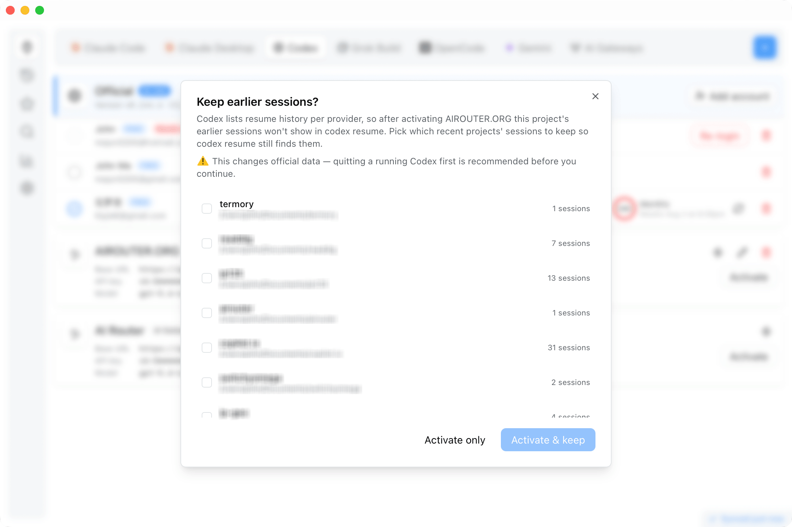
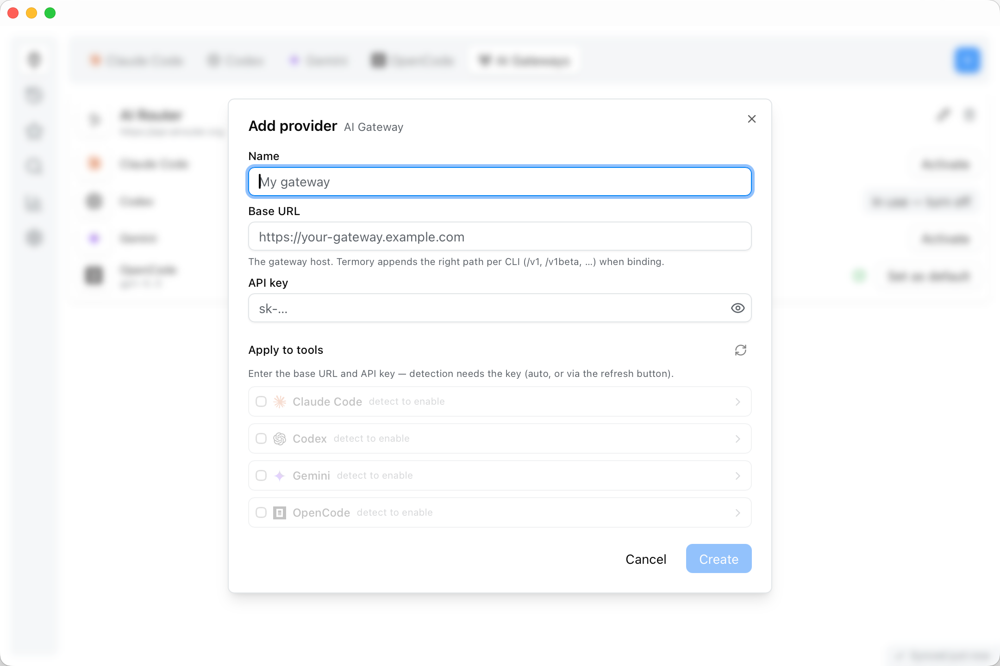
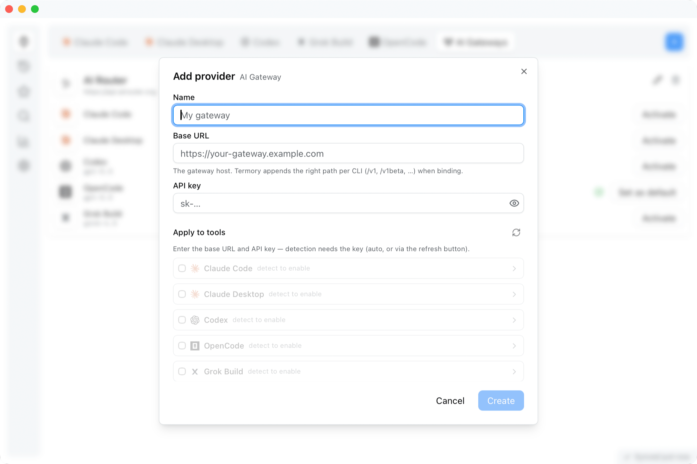
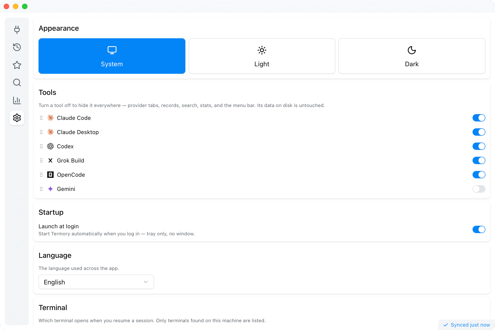

<div align="center">

# Termory

**The memory for your terminal AI coding tools — browse every session and switch API providers in a click.**

[](https://github.com/chats-is/termory/releases)
[](https://github.com/chats-is/termory/releases)
[](LICENSE)


</div>

Termory brings **Codex**, **Claude Code**, **Gemini CLI**, **OpenCode**, and **Grok Build** together in one window. Browse every past session, memory file, and skill from all your tools, keep the messages worth saving, search across everything at once, and resume any session right back in your terminal. When you want a different model or platform, switch any CLI — or the **Claude Desktop** app — to another API provider in a click — no config files, no copy-pasting keys. It runs natively on macOS, Linux, and Windows, and your history never leaves your machine.

## Documentation

📖 New here? The user guide walks through every feature — read it in [English](docs/GUIDE.md) or [中文](docs/GUIDE.zh-CN.md).

## Screenshots

<div align="center">
  
  
  
  
  
  
</div>

## Features

- **Records** — Every session, memory file, and skill from all your tools, in one place — each rendered the way its own tool shows it.
- **Resume** — Reopen any recent session straight in your terminal, running the CLI's own resume command — one click from the menu bar or a right-click.
- **Manage** — Delete or migrate any record — sessions, projects, memory — from the right-click menu, with a confirmation step.
- **Providers** — Keep named API profiles for each CLI and switch the active one with a click, or from the menu bar. See your official-plan usage right on the card — rate-limit windows, pay-as-you-go **Usage credits**, and any prepaid **Balance**, each shown only when your account actually has it — and a badge when a CLI has a newer version — click it to upgrade the CLI in place. Codex and Claude Code support multiple saved accounts — add, switch, and re-authenticate without losing session history, and your saved logins are one click away in the menu bar too.
- **Favorites** — Star any message; it's saved as a snapshot that stays readable even after the original session is gone.
- **Search** — Instant search across all your history, with a `⌘K` command palette and in-record find (`⌘F`) with term highlighting.
- **Stats** — Sessions, messages, tokens, models, projects, and an activity heatmap over any date range.
- **Private** — No servers, no accounts, no telemetry. Termory reads your history where it already lives, and only ever changes it when you explicitly ask — deleting or migrating a record, or keeping sessions across a provider switch.

## Supported tools

| Tool | Sessions | Memory | Skills | Provider switch |
|------|:--------:|:------:|:------:|:---------------:|
| Codex | ✅ | ✅ | ✅ | ✅ |
| Claude Code | ✅ | ✅ | ✅ | ✅ |
| Gemini CLI | ✅ | ✅ | ✅ | ✅ |
| OpenCode | ✅ | ✅ | ✅ | ✅ |
| Grok Build | ✅ | ✅ | ✅ | ✅ |
| Claude Desktop | — | — | — | ✅ |

Grok Build (xAI) covers sessions, memory, skills, and provider switching (via xAI's official custom-model mechanism — `[model."<id>"]` entries in `~/.grok/config.toml`; the auth.x.ai login is never touched). Claude Desktop is the GUI app (no terminal history), so it's **provider-switching only** — point it at a third-party Anthropic-compatible provider and back to Official. macOS and Windows only.

Don't use one of these tools? Turn it off in **Settings → Tools** and it disappears everywhere — provider tabs, records, search, stats, and the menu bar. Data on disk is untouched, and everything comes back when you re-enable it.

## Switch providers in a click

Every CLI keeps its own library of named API profiles — your OpenRouter key, a local model, an alternate gateway, or the official login. Pick the one you want and Termory sets it up for that CLI; the next launch just uses it. Switch from the app or straight from the macOS menu bar. Switching **Codex** covers the Codex CLI and the Codex desktop app at once — they share one config and login — and either install alone is enough: with just the desktop app (now the unified **ChatGPT** app), everything from provider switching to adding accounts still works. **Claude Desktop** is a provider here too — Termory writes its native third-party (3P) config, so you can switch the desktop app just like a CLI; it's managed as its own app, entirely separate from Claude Code.

Going back to **Official** restores your original setup exactly — your native login (OAuth tokens and credentials) is never overwritten, so you can bounce between providers as often as you like without re-logging-in.

## Download

Grab the installer for your platform from the [**Releases**](https://github.com/chats-is/termory/releases) page:

| Platform | File |
|----------|------|
| macOS (Apple Silicon / Intel) | `.dmg` |
| Linux | `.AppImage` · `.deb` · `.rpm` |
| Windows | `.msi` · `.exe` |

> [!NOTE]
> Builds are not Apple-notarized, so macOS quarantines the download and may say
> _"Termory is damaged and can't be opened"_ (common on Apple Silicon). The app
> is fine — drag it into **Applications**, then clear the quarantine flag once:
> ```bash
> xattr -dr com.apple.quarantine /Applications/Termory.app
> ```
> After that it opens normally. (Windows SmartScreen: **More info → Run anyway**.)

## Build from source

Requires [Node.js](https://nodejs.org/) 20+, the [Rust toolchain](https://rustup.rs/), and the [Tauri v2 prerequisites](https://v2.tauri.app/start/prerequisites/).

```bash
npm install
npm run tauri:dev     # run the desktop app
npm run tauri:build   # build installers
```
